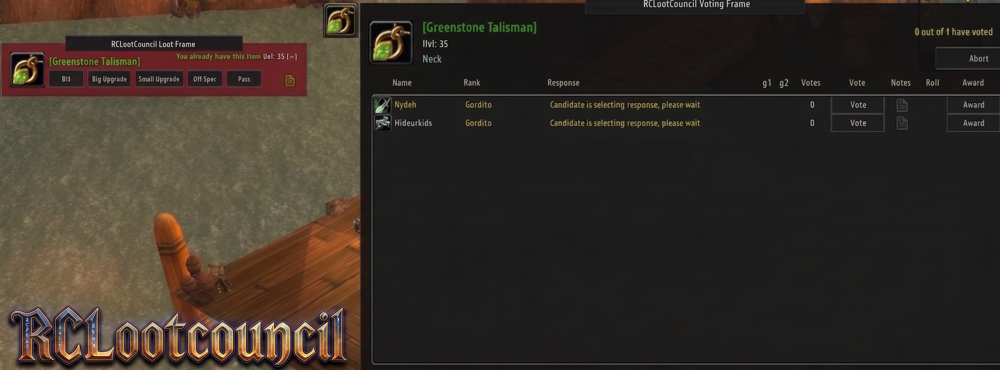
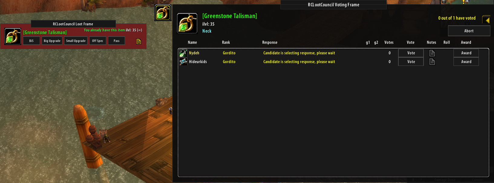
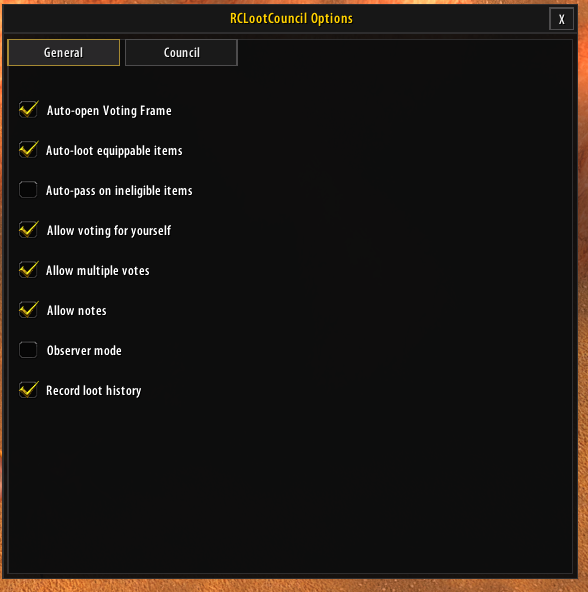
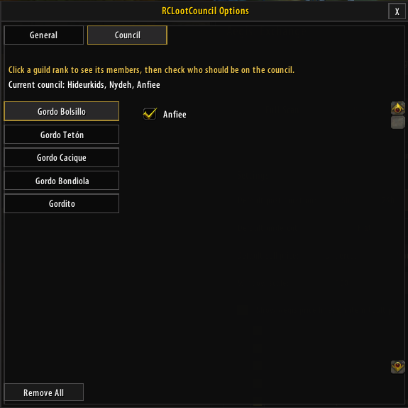
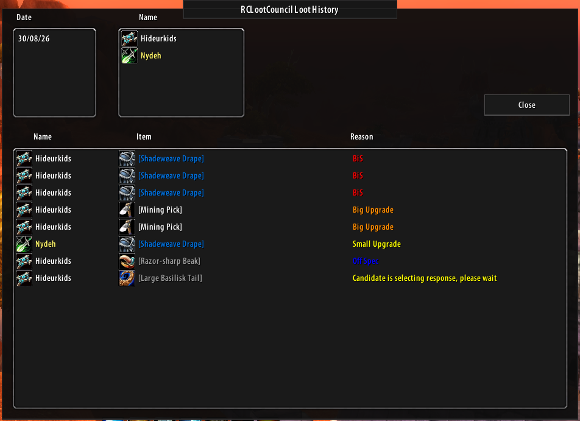

# RCLootCouncil (TurtleWoW / OctoWoW)

A backport of [Potdisc's RCLootCouncil](https://www.curseforge.com/wow/addons/rclootcouncil) to the
1.12 client for **OctoWoW**.

It lets a raid's Master Looter run **loot sessions**: candidates respond to each item (BiS / Big
Upgrade / Small Upgrade / Off Spec / Pass), the council votes on responses, and the Master Looter
awards the item — automatically handing it to the winner even if it's still sitting on the corpse.

## Requires

- [ClassicAPI](https://github.com/ClassicAPI/ClassicAPI)

## Features

- **Session-based loot distribution** — items are queued up (from the corpse, from bags, or added
  manually) and presented to eligible candidates one at a time.
- **Configurable response system** — candidates pick BiS / Big Upgrade / Small Upgrade / Off Spec /
  Pass from the Loot Frame; responses and notes show up live on the Master Looter's Voting Frame.
- **Council voting** — council members (and the Master Looter) vote on who should win each item.
- **Automatic `/roll` detection** — if you tell candidates to roll for an item, their first roll is
  picked up automatically and shown in the Voting Frame.
- **One-click Award** — awards the item straight from the Voting Frame table; works whether the item
  is still on the corpse or already in your bags, and sends it directly to the winner.
- **Guild-rank-based council management** — pick council members straight from your guild roster,
  grouped by rank, instead of typing names one by one. Anyone in your group *or* guild can be added.
- **Loot history** — every award is logged with who got it, what it was, and when (toggle in
  `/rc config` → General).
- **Version checking** across the raid/guild, so you know who's running an outdated copy.

## Screenshots

| Options — General | Options — Council |
|---|---|
|  |  |

## Commands

All commands are `/rc <command>` (or `/rclc <command>`).

| Command | Description |
|---|---|
| `/rc` | Show version info and the command list. |
| `/rc config` (or `c`) | Open the options window (General settings + Council management). |
| `/rc council` | Jump straight to the Council tab of the options window. |
| `/rc council add <name>` | Add someone to the council (must be in your group or guild). |
| `/rc council remove <name>` | Remove someone from the council. |
| `/rc add <item link or ID>` | *(Master Looter)* Manually add an item to the current/next session. |
| `/rc award` | *(Master Looter)* Start a session for items already sitting in your bags. |
| `/rc winners` | *(Master Looter)* List winners still awaiting manual bag distribution. |
| `/rc open` | Open the Voting Frame (council/observer only). |
| `/rc history` (or `h`, `his`) | Open the loot history window. |
| `/rc test [n]` | *(Master Looter)* Start a test session with `n` random items, for trying out the UI. |
| `/rc version` (or `v`, `ver`) | Check addon versions across the raid/guild. |
| `/rc reset` | Reset all of the addon's windows back to their default position. |
| `/rc debug` (or `d`) | Toggle debug chat output. |
| `/rc debug allitems` | **Testing only.** Bypass every loot filter (equippable/quality/ignore-list/BoE) so *any* looted item can start a session — handy for testing without needing real raid drops. |
| `/rc whisper` | Show the message candidates can whisper you to get help. |

## Installation

1. Download or clone this repository.
2. Copy the whole folder into your `Interface\AddOns\` directory so the addon lives at
   `Interface\AddOns\RCLootCouncil\`.
3. Make sure the folder is named exactly `RCLootCouncil` (matching the `.toc` file inside it).
4. Restart the client (or `/reload`) and enable the addon at the character-select screen.

## Compatibility notes

TurtleWoW/OctoWoW's client is a **modified 1.12 client running Lua 5.0.2**, which differs from both
stock vanilla and later retail clients in several ways this addon specifically works around:
no `#` length operator, no `%` modulo operator, `...` only valid in a function's parameter list (not
as a body expression), `SetScript` callbacks receive zero real arguments (read `this`/`arg1..N` as
globals instead), and a handful of client-specific quirks in comm message delivery and native APIs.
If you're porting this addon further or debugging something that looks "impossible", it's very
likely one of these.

## Credits

- Original addon: **Potdisc**, RCLootCouncil.
- WotLK 3.3.5a backport this port started from.
- TurtleWoW/OctoWoW (1.12) port and ongoing maintenance: **Hideurkids**.
